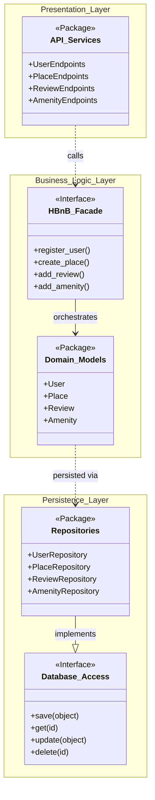
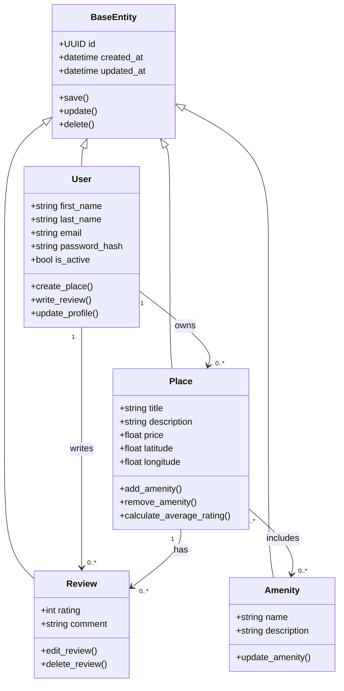
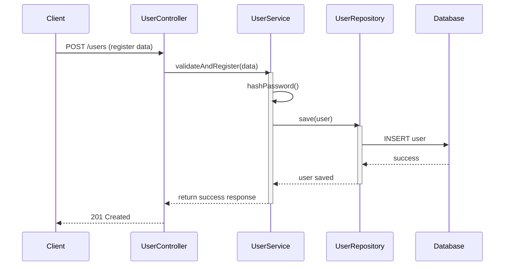
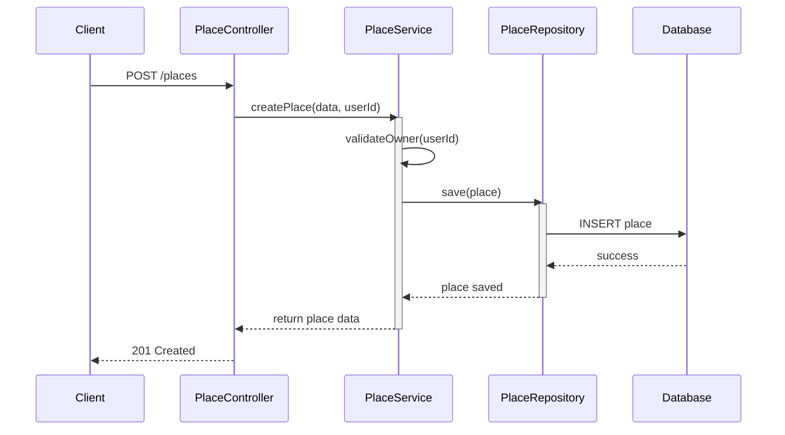
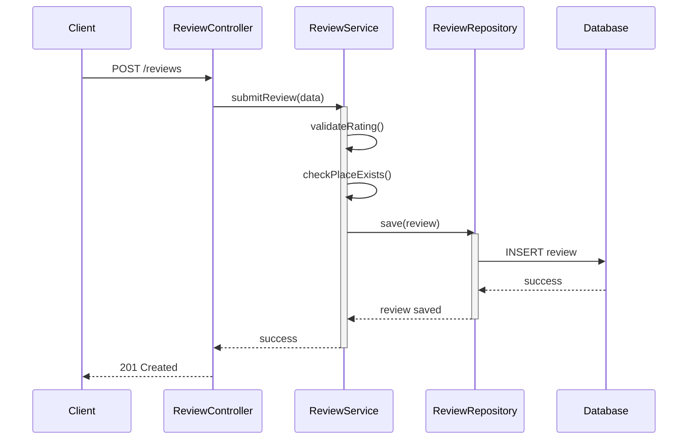
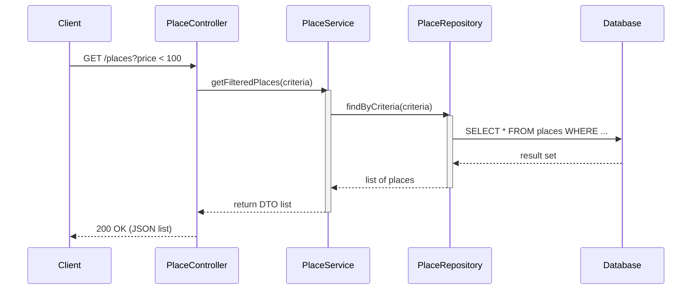

1. Introduction

1.1 Project Overview
HBnB (HolBnB) is a full-stack web application inspired by AirBnB. It enables users to list, discover, and book short-term accommodations. The platform supports user registration and authentication, property listing management, review submission, and amenity categorization.
The application follows a layered, service-oriented architecture that promotes separation of concerns, scalability, and maintainability. It is built to be deployable as a RESTful API backend, with clear boundaries between the presentation layer, business logic layer, and data persistence layer.

1.2 Purpose of This Document
This technical document serves as the definitive architectural and design blueprint for the HBnB project. It consolidates all design artifacts produced during the planning phase into a single reference that will guide developers throughout the implementation phases.
Specifically, this document:
•	Describes the overall system architecture and the rationale behind key design decisions.
•	Presents the high-level package diagram illustrating the layered structure and facade pattern.
•	Details the class diagram for the Business Logic layer, including all entities and their relationships.
•	Illustrates the flow of key API interactions through sequence diagrams.
•	Provides explanatory notes for each diagram to ensure clarity and ease of implementation.

1.3 Scope
This document covers the architectural design of the HBnB backend system. It does not cover frontend implementation, deployment infrastructure, or security configurations beyond what is necessary to understand the core design. The target audience is the development team responsible for implementing the system.

2. High-Level Architecture

2.1 Overview
The HBnB application is structured using a three-layer architecture, a widely adopted software engineering pattern that separates the application into distinct tiers, each with a well-defined responsibility. This separation ensures that changes in one layer do not directly impact other layers, improving modularity and testability.
The three layers are:
•	Presentation Layer (API Layer): Handles all incoming HTTP requests, validates input, and returns formatted responses. Built using a RESTful API framework.
•	Business Logic Layer (Service Layer): Contains the core application logic, business rules, and entity models. Acts as the intermediary between the API and persistence layers.
•	Persistence Layer (Data Access Layer): Manages all interactions with the database, including CRUD operations and query execution.

2.2 The Facade Pattern
Communication between layers is mediated through the Facade pattern. The Facade provides a simplified, unified interface to the underlying subsystems of each layer. This means:
•	The Presentation layer never directly accesses the Persistence layer.
•	All inter-layer communication passes through well-defined facade interfaces.
•	Each layer exposes only what is necessary to the layer above it, hiding implementation details.
This pattern reduces coupling between layers and makes the system easier to refactor or extend in the future.

2.3 High-Level Package Diagram
The diagram below shows the top-level package structure of the HBnB application, illustrating how the three layers are organized and how they communicate.

Key observations from the diagram:
•	The Presentation Package contains all API endpoint handlers, request validators, and response serializers.
•	The Business Logic Package contains entity classes (User, Place, Review, Amenity), service classes, and the business rule enforcement logic.
•	The Persistence Package contains repository classes and database adapters.
•	Arrows between packages pass through facade interfaces, not directly between concrete classes.

3. Business Logic Layer

3.1 Overview
The Business Logic Layer is the core of the HBnB application. It encapsulates all domain entities, their attributes, relationships, and the rules governing their behavior. This layer is intentionally decoupled from both the API framework and the database technology, making it independently testable and reusable.

3.2 Core Entities
3.2.1 User
Represents a registered user of the platform. A user can act as both a guest (booking places) and a host (listing places). Key attributes include a unique identifier, first and last name, email address, password hash, and an administrator flag.

3.2.2 Place
Represents a property listing created by a host (User). A place has descriptive attributes such as title, description, price per night, and geolocation coordinates. Each place belongs to exactly one owner and can have multiple amenities and reviews.

3.2.3 Review
Represents a review submitted by a user for a place they have visited. A review includes a rating and a text comment. Each review is associated with exactly one user (the reviewer) and one place.

3.2.4 Amenity
Represents a feature or facility associated with a place, such as Wi-Fi, parking, or a swimming pool. Amenities have a name and description, and they exist in a many-to-many relationship with places.

3.3 Relationships Between Entities
•	A User can own zero or more Places (one-to-many: User → Place).
•	A User can write zero or more Reviews (one-to-many: User → Review).
•	A Place can have zero or more Reviews (one-to-many: Place → Review).
•	A Place can have zero or more Amenities, and an Amenity can be associated with zero or more Places (many-to-many: Place ↔ Amenity).

3.4 Detailed Class Diagram
The class diagram below provides a detailed view of all entities in the Business Logic Layer, their attributes, methods, and relationships.

3.5 Design Decisions
•	All entities inherit from a common BaseModel class that provides a UUID primary key, created_at, and updated_at timestamps. This promotes consistency and reduces code duplication.
•	Passwords are stored as hashes, never in plain text. Password validation logic is encapsulated within the User entity.
•	The Place entity stores geolocation as separate latitude and longitude float fields for simplicity and compatibility with mapping APIs.
•	The many-to-many relationship between Place and Amenity is managed through an association table in the persistence layer, keeping the business logic clean.

4. API Interaction Flow

4.1 Overview
This section presents sequence diagrams illustrating the flow of data and control across the three application layers for key API operations. Each diagram traces a single API call from the moment a client sends an HTTP request to the moment a response is returned.
The sequence diagrams reveal how the facade pattern mediates communication between layers, where validation occurs, and how the persistence layer is accessed.

4.2 User Registration — POST /api/v1/users
This sequence describes the flow when a new user submits a registration request. The system validates the input, checks for duplicate email addresses, creates a new User entity, persists it, and returns the created user data.

Key steps in the flow:
•	The client sends a POST request with user data (name, email, password) to the API endpoint.
•	The Presentation Layer validates the request payload structure and required fields.
•	The request is forwarded to the Business Logic Layer via the service facade.
•	The service checks whether a user with the same email already exists by querying the Persistence Layer.
•	If the email is unique, a new User entity is instantiated and the password is hashed.
•	The new User is passed to the Persistence Layer for storage.
•	On success, the created user object (without password) is returned as a 201 response.

4.3 Place Creation — POST /api/v1/places
This sequence describes the flow when an authenticated user creates a new place listing. The system validates the request, verifies the user's identity, creates a Place entity linked to the owner, and persists it.

Key steps in the flow:
•	The client sends a POST request with place data and an authentication token.
•	The Presentation Layer validates the token and extracts the user identity.
•	The Business Logic Layer verifies the user exists and is authorized to create a listing.
•	A new Place entity is created, linked to the authenticated user as the owner.
•	The Place is persisted and the created place object is returned as a 201 response.

4.4 Review Submission — POST /api/v1/places/{place_id}/reviews
This sequence describes the flow when an authenticated user submits a review for a place. Business rules enforce that a user cannot review their own place and cannot submit duplicate reviews.

Key steps in the flow:
•	The client sends a POST request with review data (rating, text) and an authentication token.
•	The Presentation Layer validates the token and payload.
•	The Business Logic Layer retrieves the target Place to verify it exists.
•	The service enforces business rules: the reviewer must not be the owner of the place, and must not have already reviewed it.
•	If all checks pass, a new Review entity is created and persisted.
•	The created review is returned as a 201 response.

4.5 Fetching Places — GET /api/v1/places
This sequence describes the flow when a client requests a list of available places, optionally with filters. The system queries the database and returns a paginated list.

Key steps in the flow:
•	The client sends a GET request, optionally with query parameters such as location or price range.
•	The Presentation Layer parses and validates the query parameters.
•	The Business Logic Layer constructs the appropriate filter criteria.
•	The Persistence Layer executes the query and returns matching Place records.
•	The results are serialized and returned as a 200 response with pagination metadata.

5. Conclusion

This document has presented the complete architectural design of the HBnB application. The three-layer architecture with facade-based inter-layer communication provides a robust, modular, and maintainable foundation for the system.
The Business Logic Layer, with its four core entities (User, Place, Review, Amenity), captures the domain model of a property rental platform. The sequence diagrams confirm that all major API flows are well-defined and that business rules are consistently enforced at the correct layer.
This document should be treated as a living reference. As the implementation progresses and design decisions are refined, this document should be updated to reflect those changes, ensuring it remains an accurate guide for the entire development team.
